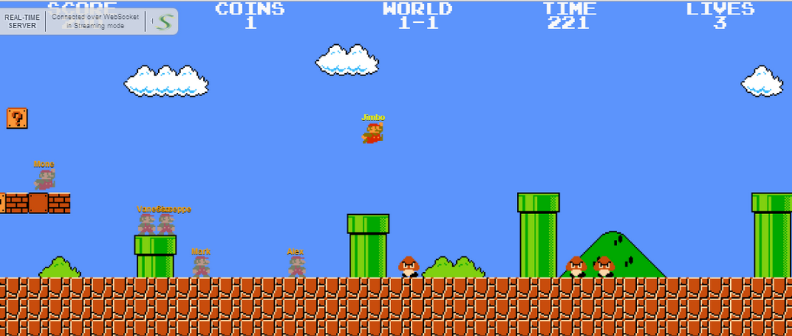

# Lightstreamer - FullScreenMario Demo - HTML Client #

This project is forked from [FullScreenMario](https://github.com/Diogenesthecynic/FullScreenMario), an HTML5 remake of the original Super Mario Brothers. 
The goal of this fork is to create a multi-player version of <b>FullScreenMario</b>, based on Lightstreamer.
This project is just a proof of concept, to experiment a multi-player game based on a client side mode.

## FullScreenMario Demo ##


This <b>FullScreenMario Demo</b> implements a simple gaming/collaborative application fed in real time via a Lightstreamer server.<br>
It's based on client-side mode:
- physics runs on the client side only,
- user's commands (key press, joystick move, device tilt, accelerometer, etc.) are streamed from client to server,
- commands of all other users are broadcast from server to each client,
- each client calculate the world independently,

Once logged in, the user can start move his or her Super Mario avatar and will see other user's avatar moving too. For each user a Super Mario avatar is created, on bottom of which the nickname chosen by the user is displayed.<br>

The demo includes the following client-side technologies:
* A [Subscription](http://www.lightstreamer.com/docs/client_javascript_uni_api/Subscription.html) containing 1 item, subscribed to in <b>COMMAND</b> mode. Each added player automatically provokes an underlying subscription to a sub-item in <b>MERGE</b> mode, to get the real-time position and state for that specific player from another feed. When a player is deleted, the underlying sub-item is automatically unsubscribed from.
* The user messages are sent to the Lightstreamer Server using the [LightstreamerClient.sendMessage](http://www.lightstreamer.com/docs/client_javascript_uni_api/LightstreamerClient.html#sendMessage) utility.


# Deploy #

Before you can run the demo some dependencies need to be solved:

-  Get the `lightstreamer.js` file from the [latest Lightstreamer distribution](http://www.lightstreamer.com/download) 
   and put it in the root folder of the demo. Alternatively you can build a `lightstreamer.js` file from the 
   [online generator](http://www.lightstreamer.com/distros/Lightstreamer_Allegro-Presto-Vivace_5_1_1_Colosseo_20130305/Lightstreamer/DOCS-SDKs/sdk_client_javascript/tools/generator.html).
   In that case be sure to include the LightstreamerClient, Subscription, DynaGrid, and StatusWidget modules and to use the "Use AMD" version.
-  Get the `require.js` file form [requirejs.org](http://requirejs.org/docs/download.html) and put it in the root folder of the demo.
-  Get the `gamecontroller.min.js` file from [HTML5 Virtual Game Controller](https://github.com/austinhallock/html5-virtual-game-controller) and put it in the root folder of the demo.

You can deploy this demo in order to use the Lightstreamer server as Web server or in any external Web Server you are running. 
If you choose the former case, please create the folders `<LS_HOME>/pages/FullScreenMario` then copy here the contents of the root folder of this project.<br>
The client demo configuration assumes that Lightstreamer Server, the Full-Screen-Mario Demo Adapters and this client are launched on the same machine. If you need to targeting a different Lightstreamer server please search this line:
```js
var lsClient = new LightstreamerClient(protocolToUse+"//localhost:8080","MARIO");
```
in `lsClient.js` file and change it accordingly.<br>
Anyway the [Full-Screen-Mario Demo Adapter](https://github.com/Weswit/Lightstreamer-example-FullScreenMario-adapter-java) hase to be deployed in your local Lightstreamer server instance.<br>
The demo is now ready to be launched.

# See Also #

## Lightstreamer Adapters needed by this demo client ##

* [Lightstreamer - FullScreenMario Demo - Java  Adapter](https://github.com/Weswit/Lightstreamer-example-FullScreenMario-adapter-java)

## Similar demo clients that may interest you ##

* [Lightstreamer - Room-Ball Demo - HTML Client](https://github.com/Weswit/Lightstreamer-example-RoomBall-client-javascript)

# Lightstreamer Compatibility Notes #

- Compatible with Lightstreamer JavaScript Client library version 6.0 or newer.

# License #
This is released under the <a href="http://creativecommons.org/licenses/by-nc-sa/3.0/">Attribution Non-Commercial Share-Alike</a> license. Full Screen Mario is meant to be both a proof of concept and an entertaining pasttime, not a source of income</a>.
